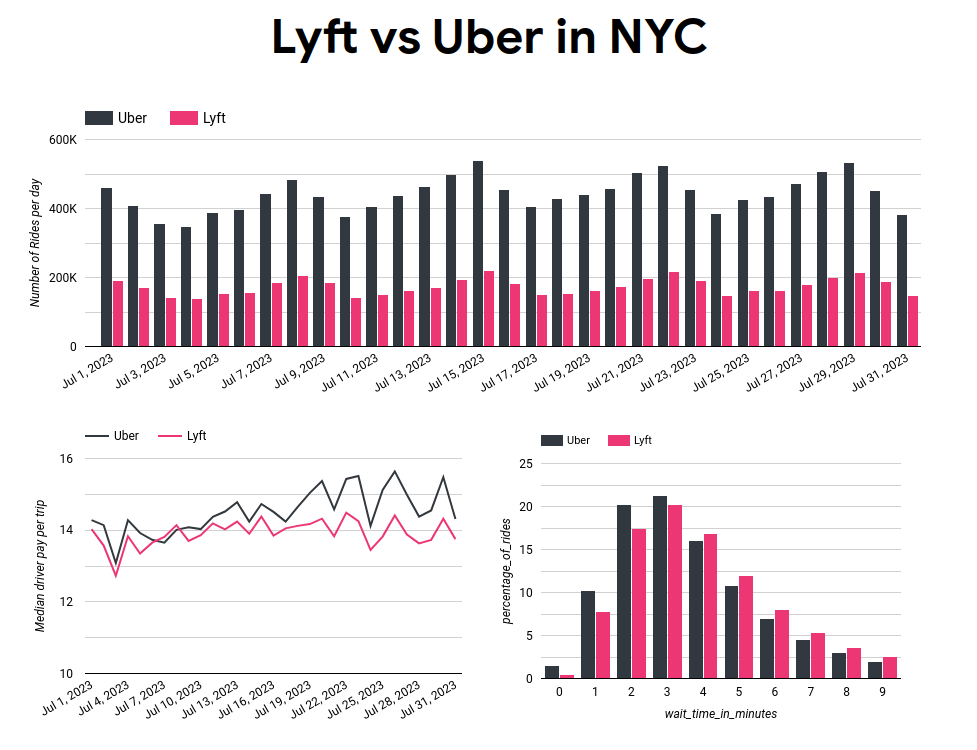

NYC Lyft vs Uber is a data pipeline I put together to learn data engineering while goign over the curriculum from [DataTalksClub Data Engineering Zoomcamp](https://github.com/DataTalksClub/data-engineering-zoomcamp).

I chose to work with well-known data from [NYC Taxi and Limousine Commission (TLC)](https://www.nyc.gov/site/tlc/about/tlc-trip-record-data.page), specifically focusing on High Volume For-Hire Vehicle Trip Records.  This includes Uber and Lyft trips within NYC (see [data dictionary](https://www.nyc.gov/assets/tlc/downloads/pdf/data_dictionary_trip_records_hvfhs.pdf)).  Historically, there are more than two high volume for-hire services in NYC, but Juno and Via ceased operations in November 2019 and December 2021, respectively.

Since this dataset is available to the public, there's probably no paradigm shifting proprietary insight one can glean from it.  But we can point to some evidence when answering trivia questions like:

1. Which day of the week has the most Uber/Lyft trips?
2. On average, does Uber or Lyft have shorter wait times?
3. Do Uber or Lyft drivers get paid more?

## Data Pipeline


## Prerequisites

- A service account key from a Google Cloud project.  The account key (in the form of a json file) is necessary for Terraform to manage cloud resources and to run data pipelines.
- `gcloud` CLI [Installed](https://cloud.google.com/sdk/docs/install#deb).


## Setup

1. Authenticate with Google cloud using service account:
    ```zsh
    gcloud auth activate-service-account --key-file=/path/to/your/gcloud-service-account-key.json
    ```
1. Run terraform to deploy infrastructure on Google Cloud.
    ```zsh
    terraform init  # initialize terraform
    terraform plan  # build a deployment plan
    terraform apply # apply the deployment plan, actually deploying the infrastructure
    ```
1. One-time prefect configuration:
    ```zsh
    # Set up a prefect profile
    prefect profile create dev_cloud
    prefect profile use dev_cloud
    prefect config set PREFECT_LOGGING_LEVEL=DEBUG
    prefect config set PREFECT_API_KEY=your_api_key
    # Choose workspace to use in prefect cloud
    prefect cloud workspace set --workspace "your_account/nyc-lyft-vs-uber"
    ```
1. Preparation before running prefect deployments: 
    ```zsh
    # in terminal 1, create a worker process and a work pool
    prefect worker start --pool 'process-pool' --type process
    # in terminal 2, create & register blocks and deployments
    python deploy_locally.py
    ```
1. Run a prefect deployment.
    ```zsh
    # Transform using DBT
    prefect deployment run dbt-nyc-lyft-vs-uber/local-process
    ```

## Results

This is a dashboard based on the data.



So, which day of the week has the most Uber/Lyft trips?  From the top bar chart, we observe both Uber and Lyft's trip count have a weekly pattern starting with relatively low volumes on Mondays, then steadily increasing mid-week.  Them volumes peak on Saturdays, followed by a drop on Sunday, then back to the trough on Monday.

From the bottom left line graph, we note that Uber drivers get paid more than Lyft drivers on a per trip basis in July 2023.  If I were to become a rideshare driver, I'm more inclined to pick Uber.  Examining the data over a longer time period may strengthen or weaken this claim.  Further causal analysis may be explain the pay difference.

On average, does Uber or Lyft have shorter wait times?  Looking at the bottom right bar chart, Uber trips' wait time distribution tend to skew slightly towards the short end.  However, the difference is probably barely noticeable to a rider since about 80% of Lyft and Uber's trips have wait times under 6 minutes.